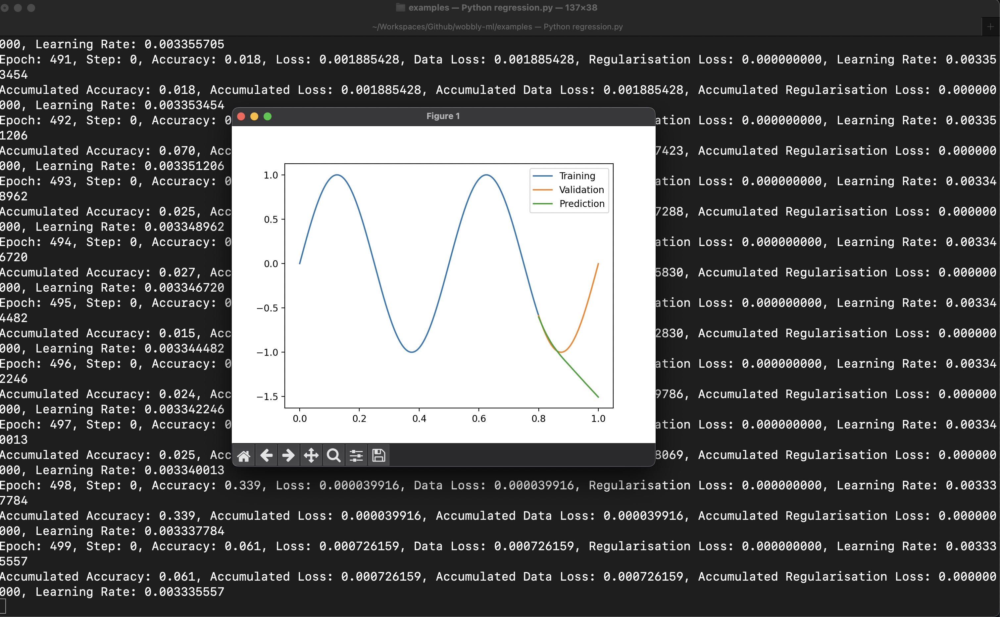

# Wobbly ML
A ML library based on the [Neural Networks From Scratch](https://nnfs.io) book.

Running the example regression gives the following results:


We can also see that the loss is very noisy. Not every impressive, but it works! Yay?

## Requirements
- Python 3.9.13 minimum.
- Python Libraries:
  - numpy
- Libraries For Examples:
  - nnfs
  - cv2
  - matplotlib

## Setup
Install the following libraries:
```
$ pip install numpy
```
Install wobbly-ml as a dev library:
```
$ sh install.sh
```

Running the examples will require additional libraries:
```
$ pip install matplotlib nnfs opencv-contrib-python-headless
``` 

## Usage
Run the example `regression.py` file:
```
$ python3 regression.py
```

## Testing
Errr... No tests yet.

## Why?
The goal of this project was to try to understand what a neural network is and how it is built. I wanted to build this simple and small library because I did not agree with how the book structured the project. That was a good exercise because I had to think careful about where each functionality belonged to.

## Why WobblyML?
I don't expected this to be stable, production ready, or accurate.

Let's just have some fun and explore!
